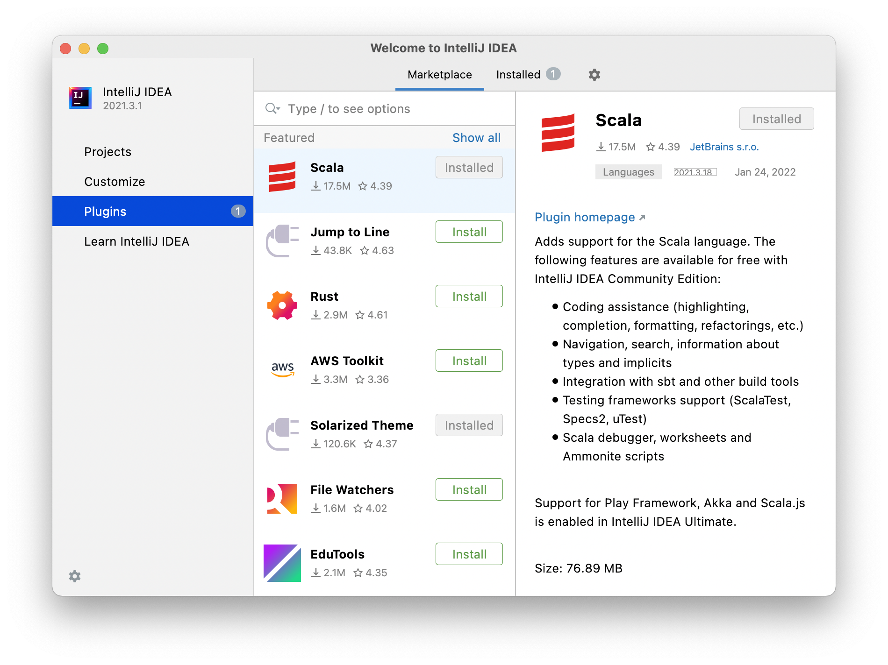
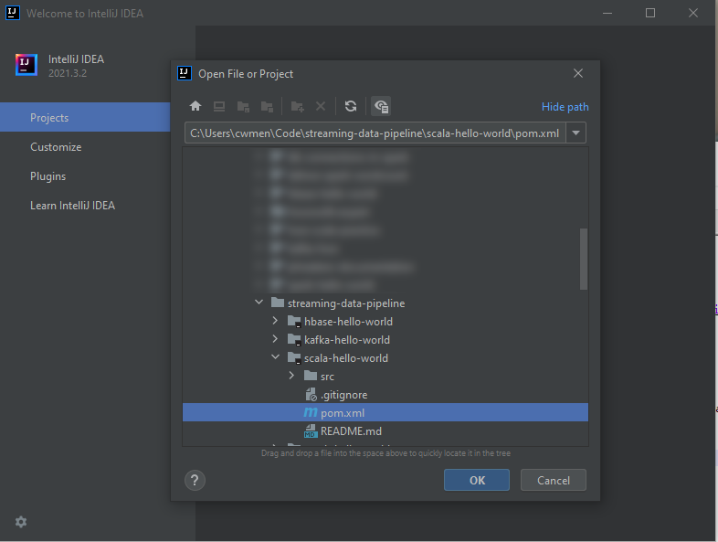
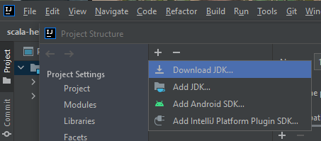
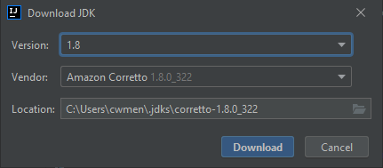
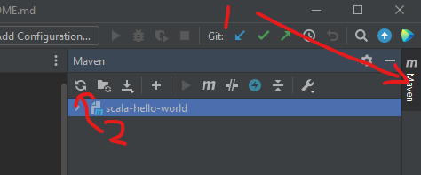
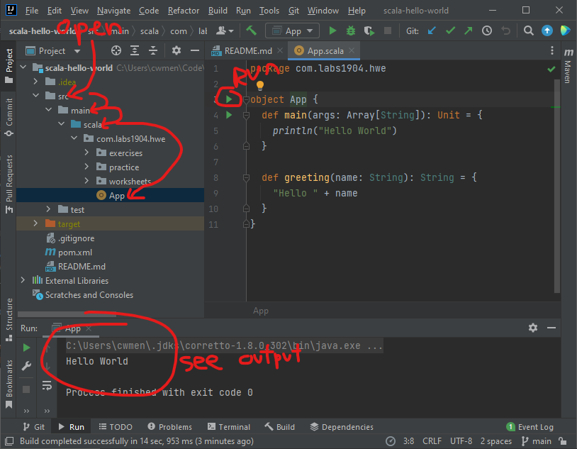
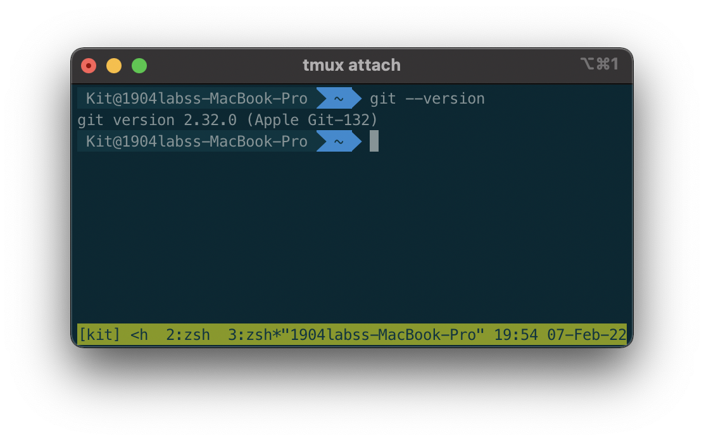

## Getting Started

Get you and your computer ready!

## Pre-requisites

Data Engineers often work with the command line as part of their job. We'll use the command line a few times
throughout this course. 

 - REQUIRED: Start with the basics 👉 [Command line basics](https://tutorial.djangogirls.org/en/intro_to_command_line/)
 - Starting with Kafka, you'll also need to know [How to Set Environment Variables](https://www.twilio.com/blog/2017/01/how-to-set-environment-variables.html)

## Setup your Computer

To run these examples, you need an environment capable of running an IDE (Intellij) which means a modern CPU and
at least 4GB of RAM.

Clone the Hours with Experts repository

https://github.com/1904labs/streaming-data-pipeline

### Installing Software

To start we'll need to download and install git

https://git-scm.com/downloads


#### Installing Intellij IDEA

Download and install Intellij IDEA Community Edition from the website

Windows: https://www.jetbrains.com/idea/download/#section=windows

Mac: https://www.jetbrains.com/idea/download/#section=mac

From the home screen, click "Plugins" and go to Marketplace.

Find and install the Scala plugin.



Restart the IDE

Open the scala-hello-world project



Click Open as Project.

Click Trust Project.

If you don't have Java installed, you can install it through IntelliJ. Click on File -> Project Structure.

Under Platform Settings click SDKs. Click the "+" sign and choose Download SDK.



For version, select `1.8` and anything you want for vendor (Amazon Corretto works well).



Click OK to save.

After installing the JDK for the first time, Intellij may be a little confused. You can refresh
the maven project by opening the Maven tool window and clicking the "Reload all Maven Projects" button.




#### Sanity check: Run the Scala App

In the scala-hello-world project (that you cloned as part of streaming-data-pipeline) open `App.scala`
by navigating down `src/main/scala/com.labs.hwe`.



Run the project by clicking the green arrow next to App. Verify that you see "Hello World" in the output.

#### Installing Git on Mac

Your mac should come with git already! Check by opening up the terminal and typing

```
git --version
```

If all goes well, you'll see something like this:


